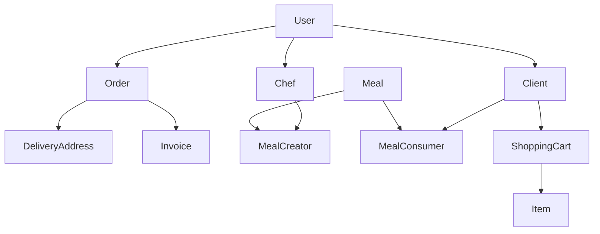

# LongLine app

### Project Description:

This project is an meal ordering app among neighboor cooks and clients.

This app helps good cooks earn extra money and take advantage that they are cooking anyway.

This app helps clients consume cheap, homely, healthy food.

### System Design - Business Capabilities:

1. Login management
2. Meals management
3. Chefs management
4. Payment management
5. Order management

### System Design - Functional Requirements:

1. List of meals.
2. Filter meals per chef, location, fusion, price.
3. Put meals in the shopping cart.
4. Checkout the shopping cart and create order.
5. List old orders and old meals.
6. Create a meal.
7. Create a chef user.

### System Design - User Stories and Noun & Verbs analysis:

1. As a user I want to **add** myself as a *client user*.
2. As a client user I want to **get all** available *meals* in a close *location* to me.
3. As a client user I want to **put** *meals* in the *shopping cart* to **checkout** later.
4. As a client user I want to **checkout** *shopping cart* and **make** an *order*.
5. As a client user I want to **see all** my old *orders and meals history*.
6. As a client user I want to **login** to the *system* and the system should **remember** my *shopping cart meals*.
7. As a user I want to **add** myself as a *chef user*.
8. As a chef user I want to **add** a *meal*
9. As a chef user I want to **see all** *orders* for me
10. As a chef user I want to **see all** my *credit*
11. As a chef user I want to **see all** my *meal orders history*
12. As a chef user I want to **login** to the system and the system should remember my *meal orders* from me.

### Diagram:  



### How to start:  
1. Clone this repo.
2. Create virtual env and install requirements.  
```pip install -r requirements.txt```
3. Create dbs and apply migrations with alembic async.  
```alembic upgrade head```
